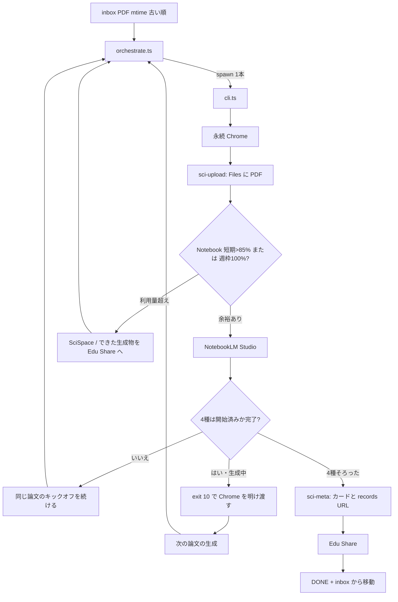
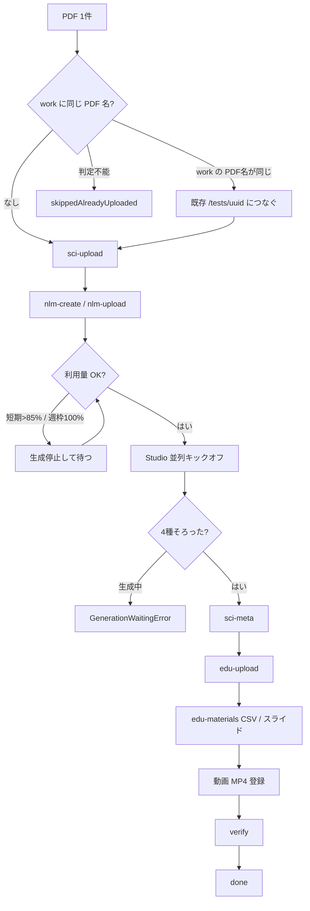
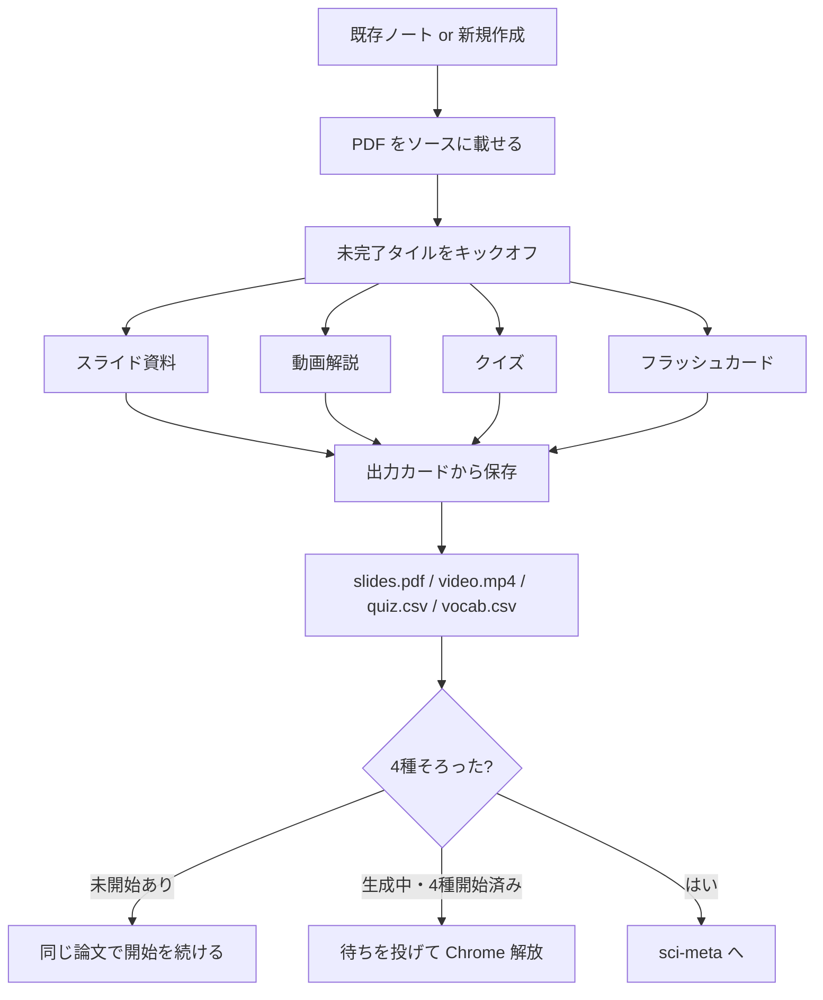
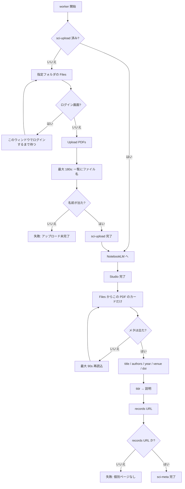

# paper-pipeline 作業フロー

Edu Share の画面は変えず、ログイン済み Chrome（`.chrome-profile`）を Playwright で操作する。公式 API はない。同じプロファイルは同時に開かない。Edu Share の `npm run dev` は止めない。

入口は `npm start`（`orchestrate.ts`）。inbox 直下の PDF だけを、1 論文ごとに `cli.ts` を子プロセスとして呼ぶ。作業フォルダの SciSpace メタ補修は `npm run repair-meta`（同じオーケストレータに `--repair-meta`）。再開の正本は `PAPER_WORK_DIR/<stem>/state.json`。

## 全体

SciSpace のカードメタは PDF 掲載から遅れて出る。そのため **掲載だけ先に行い**、NotebookLM の生成待ちのあいだに SciSpace 側を進めてからメタを取る。



終了コード: `0` 完了またはスキップ、`10` 生成待ち（4種を開始済み）、`11` Notebook 利用量待ち、`1` 失敗（4種が揃うまでは同じ論文を先に回す。揃ったあとは他の ready を先に回す）。

待ちの再確認間隔: スライド 90s、動画 60s、クイズ/単語帳 20s。同じ論文で MP4 が取れない・SciSpace メタが進まないときは 10 分空ける。Studio がツールバーだけのままなら 15 分は開き直さず、1 時間を過ぎたら開始記録を捨ててキックオフし直す。クールダウン中は Chrome を開かない。

Notebook 利用量は taskdesk / ai-usage-board の JSON（`Gemini Notebook (短期枠)` / `(週枠)`）を読む。短期枠の利用量が 85% を超えているあいだは Studio 生成を止める。週枠が 100% なら `reset_at` まで待つ。そのあいだは SciSpace 掲載・メタと、1 種でもできている生成物の Edu Share 登録を先に進める。収集・Edu Share はキックオフ済みなら続ける。Chrome をもう一つ開いて Cookie を取り直すことはしない。

## 1 論文の段階

`state.json` の `completed[]` がチェックポイント。順序は `STAGES`。



Studio の項目（スライド・解説動画・クイズ・単語帳）は `--generate` で選べる。省略時は 4 種。選んだ項目がすべて生成待ちか完了になるまで次の論文の生成には進まない。Edu Share 済みの論文にも足りない項目を後から生成できる。「後で作成」は使わない。動画は解説（2 分以上）。既存の `mm:ss · 解説` があれば再生成しない。スライドの形式は「プレゼンターのスライド」（詳細なスライド / Detailed Deck は選ばない）。既存のスライド出力（`tablet` が無くても「件のソース」付きカード）や「スライド資料を生成して…」があればスライドも再生成しない。

## NotebookLM Studio



- スライド: LIST_ARTIFACTS の PDF URL。印刷 PDF は使わない
- 動画: Studio カードの「動画をダウンロード」だけ。プレーヤーのストリーム取得はしない。LIST_ARTIFACTS の `/download` はスライド PDF/ZIP なので使わない
- 生成中は「生成しています」とタイルの `sync`。開始 20 分以内は押し直さない。ツールバーだけで 1 時間カードが無ければ開始記録を捨てる
- MP4 が取れなければ同じ論文をすぐ開き直さない
- ソース列のメニューは触らない。「ソースを削除」が開いたら Escape

## SciSpace

指定フォルダへ PDF を載せ、隣カードを混ぜずにメタと `/records/…` を取る。フォルダ URL は保存しない。ログイン待ち中は画面を触らない。フォルダ URL だけではノートのチャット/Home のことがあるので、`Files (N)` タブを押し、Files 表（`Uploaded on` または `TL;DR` 列）まで最大 15 分。サイドバーの `Upload PDFs` / `Files (` だけでは Files とみなさない。一覧検索は Files ツールバーの入力だけ。メタが取れなければ後回しにせず失敗する。



カード取り: 検索欄に stem → ファイル名を含む行の祖先テキスト → 次の別 `.pdf` 行で切る。ナビ文言は捨てる。タイトルがファイル名だけで著者・掲載・年が無い貼り付けは空にする。

`/records/…` は一覧の `a[href]` をファイル名ヒントで照合し、無ければファイル名をクリックして遷移先かポップアップを見る。正規形は `https://scispace.com/records/{id}`。

### Edu Share で使う SciSpace フィールド

| `state.json` | Edu Share |
|---|---|
| `title` | タイトル |
| `doi` | DOI 欄 |
| `tldr` | 説明 |
| `filesPaste` | SciSpace Files から取った原文（判定・再取得用）。Edu Share のメタ欄にはタイトル・年著者行・掲載を原文のまま入れる（`Show Less` も残す）。TL;DR 本文は説明欄へ |
| `venue` | 業界推定の材料 |
| `scispaceUrl` | 論文ページの SciSpace URL |

失敗ショットは `work/<stem>/failures/scispace*.png`。

## Edu Share

1. `/upload` に PDF。自動入力完了まで待つ。ログイン待ち中は触らない
2. SciSpace のメタ（タイトル・年著者行・掲載）を原文のまま貼り付け欄へ。TL;DR は説明。DOI は DOI 欄。業界は「その他」にしない。著者のデモ `A. Einstein` / `A. K. Dewdney` は使わない
3. 既存論文なら一覧の `/tests/{id}` につなぐ。削除ボタン `.bg-red-50` はエラーではない
4. quiz.csv / vocab.csv / slides.pdf、動画は `POST /api/tests/{id}/material/video`
5. SciSpace 個別 URL を保存し、PDF・スライド・動画・CSV 開始まで verify

操作手順（inbox に置いて起動し、完了を見分けるまで）は [inbox.md](inbox.md)。

## 実行

```bash
cd tools/paper-pipeline
npm start -- --headed
npm start -- --headless
npm start -- --only paper.pdf --from sci-meta
npm run repair-meta -- --headed
npm run worker -- --only paper.pdf --headless
```

止めるときは SIGINT（worker が Chrome を閉じてから終了）。`npm start` は inbox の PDF だけを見る。作業フォルダだけの SciSpace メタ補修は `npm run repair-meta`。同じ Chrome プロファイルなので同時には起動しない。`--headless` はログインや追加確認のときだけ画面を出す。
